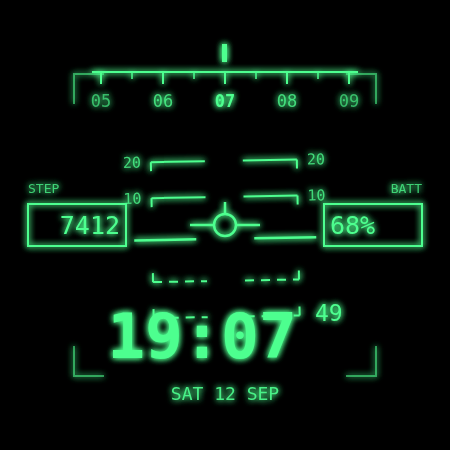

# Viper HUD

Um watch face para **Wear OS** no estilo do HUD de um caça dos anos 80–90.
Fósforo verde sobre preto absoluto, marcador de trajetória no centro, escada de
arfagem que inclina com o punho, fita de minutos no topo e a temperatura do
tempo à esquerda. Notificação não lida acende uma antena de datalink embaixo.

Abaixo de **15% de bateria** a escada de arfagem se apaga — do mesmo jeito que
um GCAS limpa o HUD no avião de verdade — e o vidro vira um mostrador de
ameaça, escalando um degrau a cada cinco pontos de carga:

| Carga | Aviso | Símbolo | Cor |
|---|---|---|---|
| 15% – 11% | `NAILS` | arcos tracejados de varredura | âmbar |
| 10% – 6% | `SPIKE` | anel de travamento fecha no marcador | âmbar |
| 5% – 0% | `SINGER` | breakaway X | vermelho |

As três palavras são [códigos de brevidade multisserviço](https://en.wikipedia.org/wiki/Multiservice_tactical_brevity_code)
de verdade, e contam uma história do começo ao fim: **NAILS** é radar varrendo
sem ter te achado, **SPIKE** é radar te seguindo, **SINGER** é míssil saindo do
trilho. O anel do SPIKE também é literal — é assim que o RWR marca uma ameaça
no momento em que ela entra em track.

Duas licenças poéticas, ditas com todas as letras: nada disso fica no HUD no
avião real (vive no **RWR**, um mostrador redondo separado), e o breakaway X é
na verdade símbolo do GCAS, emprestado aqui por ser a coisa mais alta que um
HUD sabe dizer. A cor não é licença: âmbar é atenção e vermelho é emergência,
como no painel de verdade.



## Como é feito

Escrito em **Watch Face Format** (WFF) — XML declarativo, sem uma linha de
Kotlin. É o formato que o Google exige para watch faces novas na Play Store, e
o sistema renderiza tudo nativamente, sem um processo do app rodando. O arquivo
inteiro é [`watchface/src/main/res/raw/watchface.xml`](watchface/src/main/res/raw/watchface.xml).

| | |
|---|---|
| Formato | Watch Face Format v4 |
| Compatibilidade | Wear OS 6 e acima (`minSdk 36`) |
| Tela virtual | 450 × 450, recortada em círculo |
| Tipografia | [B612 Mono](https://github.com/polarsys/b612) — a fonte que a Airbus encomendou para displays de cockpit (OFL, embarcada no APK) |

### Por que v4

A versão do formato **não é nível de otimização** — é um piso de
compatibilidade. Cada número exige um Wear OS mais novo e destrava recursos; o
renderizador é o mesmo. A regra saudável é ficar na menor versão que tenha o
que você usa, e aqui a conta fecha em v4:

| WFF | Wear OS mínimo | API | O que este arquivo usa dela |
|---|---|---|---|
| 1 | 4 | 33 | toda a base: HUD, escada, `Gyro`, `Condition` |
| 2 | 5 | 34 | `[WEATHER.*]` na caixa TEMP |
| 3 | 5.1 | 35 | `blendMode="PLUS"`, para o brilho somar como fósforo de verdade |
| 4 | 6 | 36 | `Variant` com `duration`/`interpolation`: a troca para o modo ambiente suaviza em vez de cortar |

A v5 existe nos schemas do Google, mas **não está na tabela de compatibilidade**
— não há Wear OS público que a execute, então declará-la deixaria o watch face
sem instalar em lugar nenhum.

### O que está na tela

| Elemento | Fonte de dado |
|---|---|
| Hora | `[HOUR_0_23_Z]` ou `[HOUR_1_12_Z]` conforme `[IS_24_HOUR_MODE]`, com `[MINUTE_Z]` |
| Data | `[DAY_OF_WEEK_S]` `[DAY_Z]` `[MONTH_S]`, em caixa alta |
| Fita de minutos | `[MINUTE]` — cinco marcas de um minuto, a atual sob o índice |
| Caixa TEMP | `[WEATHER.TEMPERATURE]` com a unidade de `[WEATHER.TEMPERATURE_UNIT]`, atrás de um teste de `[WEATHER.IS_AVAILABLE]` |
| Caixa BATT | `[BATTERY_PERCENT]` |
| Escala de altitude | fita com riscos à direita; o cursor desliza com `[BATTERY_PERCENT]` |
| Gun cross | fixo, sem dado: marca para onde o nariz aponta |
| Antena de datalink | `[UNREAD_NOTIFICATION_COUNT]`, só desenhada quando há algo não lido |
| Escada de arfagem | `[ACCELEROMETER_ANGLE_Y]` e `[ACCELEROMETER_ANGLE_X]` via `Gyro` |
| Escalada de aviso | três `Compare` sobre `[BATTERY_PERCENT]`, do mais grave para o menos; `[SECOND] % 2` pisca a legenda |

Nenhuma permissão é pedida na instalação. O clima vem do sistema, não do app.

### Sobre a simbologia

O HUD do F-16 mostra velocidade e altitude em duas apresentações que o piloto
escolhe: *scales*, a fita vertical com riscos, e *counter*, o número numa
caixa. As caixas TEMP e BATT são a segunda; a fita à direita é a primeira,
e o cursor dela anda com a carga, porque de tudo que está na tela a bateria é
o único dado que cai num 0–100 honesto. Temperatura não tem escala natural, e
um cursor sobre um intervalo inventado seria enfeite fingindo ser dado — por
isso a esquerda ficou só na caixa.

A **escala de inclinação** do manual foi desenhada, montada e cortada: num
mostrador de 450 px os riscos dela embolam com os degraus tracejados de -10 e
-20 da escada de arfagem, e ela é redundante, já que a escada inclinando é a
própria indicação de rolamento. No avião o vidro é grande o bastante para as
duas coisas coexistirem; no pulso, não.

### Modo ambiente

Fica só o marcador de trajetória, a hora e a data, em verde apagado — sem fita,
sem escada, sem caixas. O aviso continua aparecendo, mas **parado**: em ambiente
a tela só redesenha uma vez por minuto, então um pisca de 1 Hz congelaria em um
estado qualquer.

O mostrador não tem segundos, e isso não é só estética: fora do estado de aviso
nada na tela muda por segundo, então `[SECOND]` só aparece no pisca das legendas
de alerta. A expectativa é que o sistema caia para um redesenho por minuto no
uso normal — não medi em hardware.

## Rodando

Precisa do Android Studio com o SDK 36 e um relógio (ou emulador) com Wear OS 6+.

```bash
./gradlew :watchface:installDebug
```

Depois é só escolher o watch face na lista do relógio.

**Clima.** O relógio só sabe a temperatura se souber onde está, e para isso ele
usa o celular pareado ou a rede — nunca o GPS de bordo, para poupar bateria. Num
emulador solto, sem celular pareado, a caixa TEMP fica em `--` até você simular
uma localização:

```bash
adb shell cmd location set-location-enabled true
adb shell cmd location providers add-test-provider gps
adb shell cmd location providers set-test-provider-enabled gps true
adb shell cmd location providers set-test-provider-location gps --location -25.5163,-54.5854
```

**Avisos.** Para percorrer os três degraus sem esperar a bateria acabar:

```bash
adb shell dumpsys battery set level 13   # NAILS
adb shell dumpsys battery set level 8    # SPIKE
adb shell dumpsys battery set level 3    # SINGER
adb shell dumpsys battery reset          # volta ao normal
```

As legendas saem de `strings.xml`, então trocá-las é mudar uma palavra.

## Publicando

O `build.gradle.kts` do módulo ainda aponta para a chave de debug. Antes de subir
para a Play Store, troque por uma chave própria e mantenha
`isShrinkResources = false`: o XML do formato referencia as fontes e o preview
pelo nome, e o shrinker não enxerga esse uso.

## Estado

O XML foi validado contra o schema oficial do formato (os XSDs de
[`google/watchface`](https://github.com/google/watchface), com um validador XSD
1.1) — zero erros de elemento, atributo, enum ou aninhamento. Como o schema
trata expressão como texto livre, ele **não** verifica se uma fonte de dado
existe na versão declarada; por isso cada uma das 16 fontes usadas aqui foi
cruzada à parte com os enums das cinco versões da spec, junto com os atributos
que também puxam o piso (`blendMode` e o `Variant` animado). O resultado bateu
com a v4 do manifesto.

O que nenhuma validação estática pega é o comportamento em hardware. Um ponto
merece atenção no primeiro teste: a inclinação da escada depende de como o
acelerômetro está orientado no relógio. Se ela girar no eixo errado ou
invertida, troque `ACCELEROMETER_ANGLE_Y` por `ACCELEROMETER_ANGLE_X` no
elemento `Gyro` — há um comentário no XML marcando o lugar.

### Sobre o ponto laranja

O indicador de notificação do sistema é desenhado **por cima** do watch face.
Nenhum formato de watch face consegue trocar, mover ou esconder ele — a antena
daqui é um segundo indicador, não um substituto. Quem desliga o ponto é o dono
do relógio, nas configurações de notificação.

Também não existe gatilho de "chegou notificação" no formato: os eventos são
`TAP`, `ON_VISIBLE` e `ON_NEXT_SECOND`/`MINUTE`/`HOUR`. Dá para pulsar a antena
continuamente enquanto houver não lidas, mas isso obriga o mostrador a
redesenhar a cada segundo, e por isso ela é estática.

### Ideias para depois

- **Complications** nas caixas TEMP e BATT, para escolher o que aparece ali.
- **Cores configuráveis** — âmbar e azul gelo além do verde, via `ColorConfiguration`.
- **`letterSpacing`** nos rótulos: deixaria TEMP e BATT mais perto de um
  placard de cockpit. Disponível desde a v2, ainda não aplicado.
